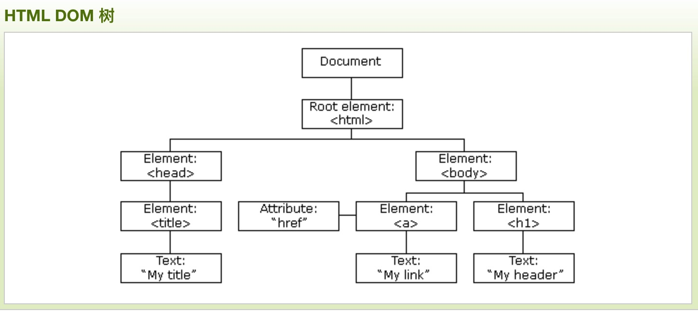
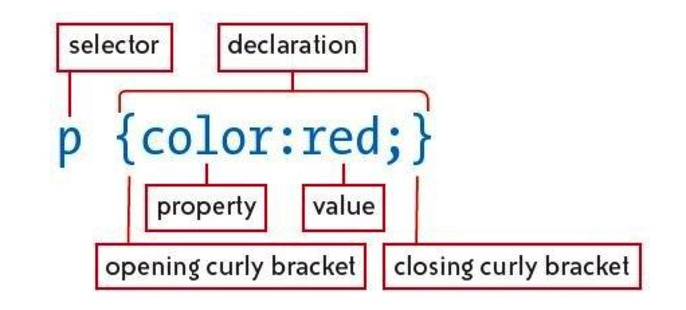
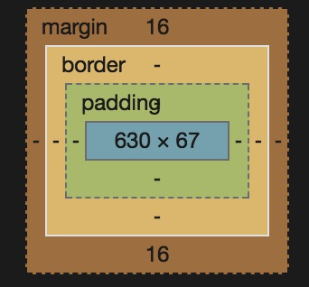

# html+css

<!-- TOC -->

- [html+css](#htmlcss)
    - [一、html](#一html)
        - [1、关于闭合标签](#1关于闭合标签)
        - [2、属性](#2属性)
        - [3、复合元素](#3复合元素)
        - [4、HTML文档剖析](#4html文档剖析)
        - [5、文档对象模型](#5文档对象模型)
    - [二、css](#二css)
        - [1、css工作原理](#1css工作原理)
            - [1、css规则](#1css规则)
            - [2、选择器](#2选择器)
            - [3、伪类](#3伪类)
                - [1、链接伪类](#1链接伪类)
                - [2、结构化伪类](#2结构化伪类)
            - [4、伪元素](#4伪元素)
            - [5、继承](#5继承)
            - [6、层叠](#6层叠)
            - [7、规则声明](#7规则声明)
        - [2、定位元素](#2定位元素)
            - [1、盒模型](#1盒模型)
            - [2、浮动和清除](#2浮动和清除)
            - [3、定位](#3定位)
                - [1、定义上下文](#1定义上下文)
                - [2、显示属性](#2显示属性)
            - [4、背景](#4背景)
        - [3、文字和文本](#3文字和文本)
            - [1、来源](#1来源)
            - [2、字体](#2字体)
            - [3、文本](#3文本)
        - [4、页面布局](#4页面布局)
        - [5、界面组件](#5界面组件)
            - [1、导航菜单](#1导航菜单)
            - [2、表单](#2表单)
            - [3、弹出层](#3弹出层)

<!-- /TOC -->

## 一、html

### 1、关于闭合标签

HTML5没有特殊要求，可以加可以不加，比如

`` or ``

### 2、属性

``

src(source)和alt(alternative)就是属性

### 3、复合元素

- `<h1>`这样的标题
- `<ul><li></li></ul>`这样的复合元素
- `<p><em></em></p>`这样的嵌套标签

### 4、HTML文档剖析

```html
# HTMl5语法编写的最简单HTML页面模板
<!DOCTYPE html>
<html>
    <head>
        <meta charset="utf-8" />
        <title>An HTML Template</title>
    </head>
    <body>
        <!-- 这里是网页内容 -->
    </body>
 </html>
```

### 5、文档对象模型



## 二、css

### 1、css工作原理

#### 1、css规则



#### 2、选择器

- 分组选择符 以`逗号`作为分隔符
- 上下文选择符 以`空格`作为分隔符
  - 子选择符 以`>`作为分隔符
  - 紧密兄弟选择符 以`+`作为分隔符
  - 一般兄弟选择符 以`~`作为分隔符
  - 通用选择符 以`*`作为分隔符
- id和class选择符
  - class 以`.`作为分隔符 **不唯一**
  - id 以`#`作为分隔符 **唯一**
- 属性选择符
  - 属性名 img[src]
  - 属性值 img[src=""]

#### 3、伪类

##### 1、链接伪类

```css

a:link {color: black;} //等着用户点击
a:visited {color: gray;} //用户点击过
a:hover {text-decoration: none;} //鼠标悬停
a:active {color: red;} //正在点击，鼠标没释放

```

- :focus
- :target

##### 2、结构化伪类

- :first-child
- :last-child
- :nth-child()

#### 4、伪元素

- ::first-letter
- ::first-line
- ::before
- ::after

#### 5、继承

#### 6、层叠

- 规则一：找到所有元素和属性的声明
- 规则二：按照顺序和权重 !important;
- 规则三：按元素优先级  **I-C-E**
- 规则四：顺序决定权重

#### 7、规则声明

- 文本值
- 数字值
- 颜色值

### 2、定位元素

- position 控制页面上元素的位置关系
- display 控制元素是堆叠、并排、隐藏
- float 控制元素组成多栏布局

#### 1、盒模型



- 边框（ border）。 可以设置边框的宽窄、样式和颜色。
- 内边距（ padding）。 可以设置盒子内容区与边框的间距。
- 外边距（ margin）。 可以设置盒子与相邻元素的间距。

> **外边距叠加**
>
> 解释是有`一连串段落`用了相同的样式，那么第一段和最后一段的上外边距和下外边距决定了`这连串段落`与`其它元素`之间的间距，
>
> 那么中间的段落呢，根本不需要上外边距和下外边距加起来这么宽的间距。因此以`上外边距和下外边距`宽的为标准，

#### 2、浮动和清除

```html
<style>

.clearfix:after {
    content: ".";
    display: block;
    height: 0;
    visibility: hidden;
    clear: both;
}

</style>

<div class="clearfix"></div>
```

#### 3、定位

- static 静态的，默认
- relative 相对定位
- absolute 绝对定位，会随着窗口移动
- fixed 固定定位，不会随着窗口移动

##### 1、定义上下文

absolute一般是参照body，但是如果把父元素设置为relative，那么就会参照父元素。

##### 2、显示属性

- 块级元素 display: block
- 行内元素 display: inline
- 隐藏 display: none 回收空间
- 隐藏 visibility: hidden 不回收空间
- 显示 visibility: visible

#### 4、背景

- background
- background-color
- background-image
- background-repeat
- background-position
- background-size
- background-attachment
- ...

### 3、文字和文本

#### 1、来源

- 用户机器安装的字体
- 保存在第三方网站上的字体 link
- 自己服务器上的字体 @font-face

#### 2、字体

- font
- font-family
- font-size
- font-style
- font-weight
- font-variant

#### 3、文本

- text-indent
- text-decoration
- text-align
- text-transform
- letter-spacing
- word-spacing
- line-height
- vertical-align

[实例：文本排布](js/html/text.html)

### 4、页面布局

- 固定宽度 960px合适
- 流动
- 弹性

    布局高度一般设置auto
    宽度需要精确设置

[实例：页面布局](js/html/flow.html)

### 5、界面组件

UI（User Interface）

#### 1、导航菜单

[实例：导航栏](js/html/nav.html)

[实例：菜单](js/html/menu.html)

#### 2、表单

```html
    <label for="user_name">User</label>
    <input type="text" id="user_name" name="user_name">
```

> for 属性 与 id 属性 通过 相同 的 值 关联 起来 后， 用户 点击 标注 文本 也可以 选择 单选 按钮 和 复选框。

- text： 基本 的 单行 文本 框。
- password： 文本 显示 为 掩 码。
- checkbox： 复选框。
- radio： 单选 按钮。
- submit： 提交 表单 的 按钮。
- time、 date、 search： HTML5 文本 框 的 变体。

#### 3、弹出层

- z-index 越大越上面，默认0，只对非static有效

[实例：弹出层](js/html/menu.html)