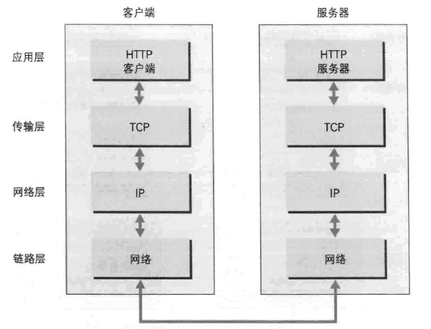
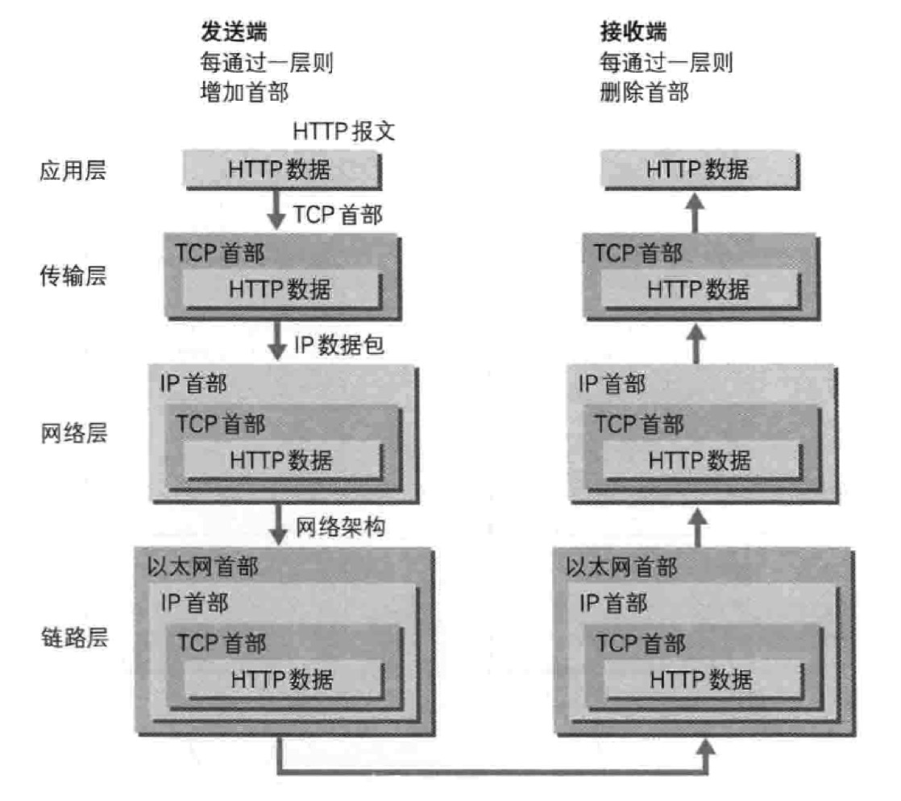
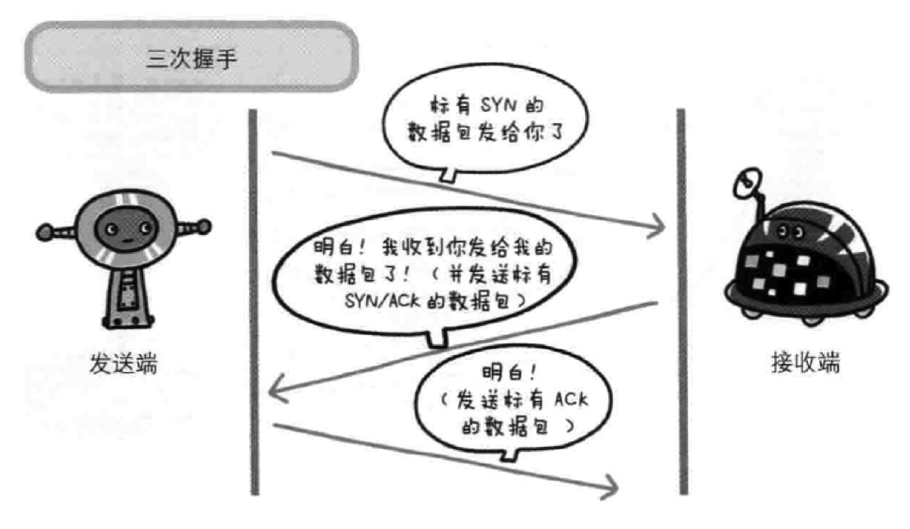
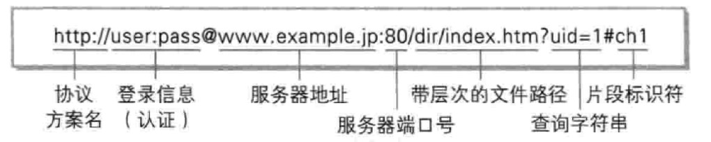
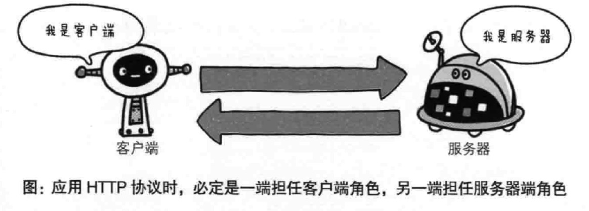
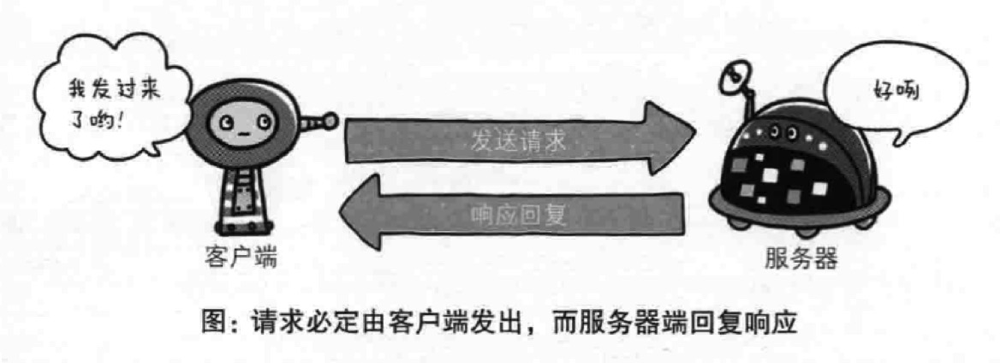
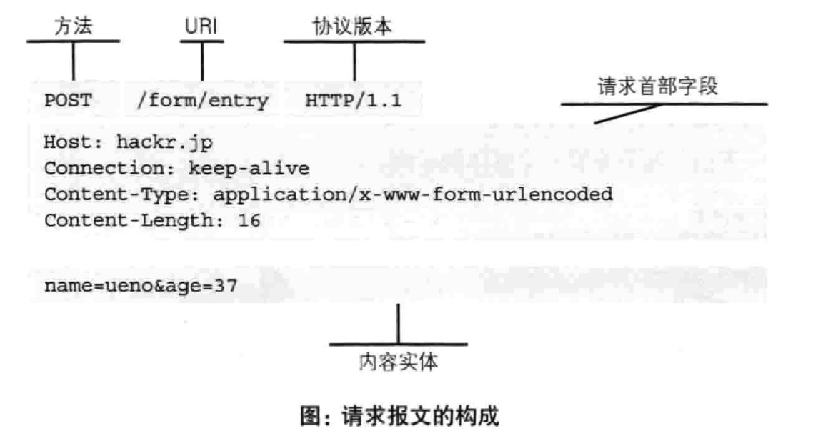
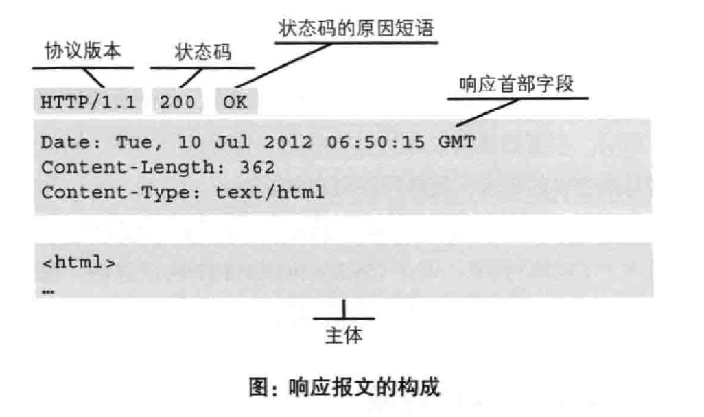
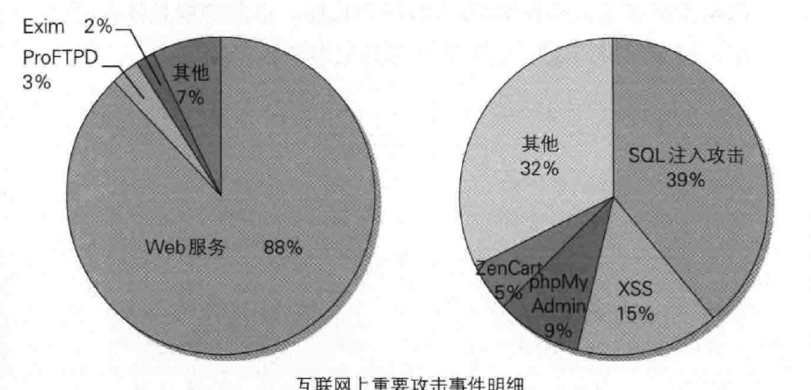

# HTTP协议

<!-- TOC -->

- [HTTP协议](#http协议)
    - [一、网络基础](#一网络基础)
        - [1、TCP/IP协议族各层作用](#1tcpip协议族各层作用)
            - [应用层](#应用层)
            - [传输层](#传输层)
            - [网络层](#网络层)
            - [链路层](#链路层)
        - [2、TCP/IP 通信传输流](#2tcpip-通信传输流)
        - [3、关系密切的IP、TCP、DNS协议（3次握手）](#3关系密切的iptcpdns协议3次握手)
        - [4、URI和URL](#4uri和url)
    - [二、简单的HTTP协议](#二简单的http协议)
        - [1、通过请求和响应的交换达成通信](#1通过请求和响应的交换达成通信)
        - [2、HTTP是一种无状态协议](#2http是一种无状态协议)
        - [3、HTTP方法](#3http方法)
        - [4、持久连接 keep-alive](#4持久连接-keep-alive)
        - [5、cookie](#5cookie)
    - [三、HTTP报文](#三http报文)
        - [2、用于HTTP协议交互的信息称为HTTP报文](#2用于http协议交互的信息称为http报文)
        - [2、多部分对象集合](#2多部分对象集合)
    - [四、HTTP状态码](#四http状态码)
    - [五、HTTP协作的Web服务器](#五http协作的web服务器)
        - [1、通信数据转发：代理、网关、隧道](#1通信数据转发代理网关隧道)
        - [2、缓存](#2缓存)
    - [六、HTTP首部](#六http首部)
        - [HTTP首部字段](#http首部字段)
    - [七、HTTPS](#七https)
        - [1、HTTP的缺点](#1http的缺点)
        - [2、HTTP+加密+认证+完整性保护 = HTTPS](#2http加密认证完整性保护--https)
    - [八、确认访问用户身份的认证](#八确认访问用户身份的认证)
        - [1、HTTP认证](#1http认证)
        - [2、Session管理和Cookie应用](#2session管理和cookie应用)
    - [九、基于HTTP的功能追加协议](#九基于http的功能追加协议)
        - [1、HTTP瓶颈](#1http瓶颈)
        - [2、Ajax](#2ajax)
        - [3、使用浏览器进行全双工通信的WebSocket](#3使用浏览器进行全双工通信的websocket)
    - [十、构建Web内容的技术](#十构建web内容的技术)
        - [1、HTML+CSS+JavaScript](#1htmlcssjavascript)
        - [2、Web应用](#2web应用)
        - [3、数据格式](#3数据格式)
    - [十一、Web攻击技术](#十一web攻击技术)
        - [1、针对Web的攻击技术](#1针对web的攻击技术)
        - [2、针对Web的攻击模式](#2针对web的攻击模式)
        - [3、密码破解](#3密码破解)
    - [十二、参考资料](#十二参考资料)

<!-- /TOC -->

## 一、网络基础

### 1、TCP/IP协议族各层作用

#### 应用层

决定了向用户提供应用服务时通信的活动

比如：FTP、DNS、HTTP

#### 传输层

提供数据传输

比如：TCP、UDP

#### 网络层

处理在网络上流动的数据包（网络传输最小单位）

比如IP协议

#### 链路层

用来处理连接网络的硬件部分

### 2、TCP/IP 通信传输流

发送端从应用层往下走，接收端则往应用层往上走

发送端每经过一层打上一个该层的首部信息  -> 封装encapsulate

接收端每经过一层把首部信息消去



### 3、关系密切的IP、TCP、DNS协议（3次握手）

```bash

IP协议的作用是把各种数据包传送给对方。 IP地址和MAC地址。 ARP协议（解析地址的协议)。

TCP协议把数据准确的传给对方，可以分割大数据。 为了准确传输，采用三次握手策略。

*三次握手（three-way handshaking）
发送端发送一个带有SYN(synchronize)标志的数据包给对方
接收端收到后，回传一个带有SYN/ACK标志的数据包表示确认信息
发送端再回传一个ACK(acknowledgement)标志的数据包，代表握手结束

DNS服务提供域名到IP地址之间的解析服务  发送端发送http://t66y.com/，DNS解析对应一个IP地址，然后访问服务器

```



### 4、URI和URL

http://t66y.com/ => URL 统一资源定位符(Uniform Resource Locator)

http://t66y.com/index.php  => URI  统一资源标识符(Uniform Resource Idenitifier)

绝对URI格式


## 二、简单的HTTP协议

客户端：请求访问文本或图像等资源的一端

服务端：提供资源响应的一端




### 1、通过请求和响应的交换达成通信

请求报文是由请求方法、请求URI、协议版本、可选的请求首部字段和内容实体构成


响应报文是由协议版本、状态码、状态码的原因短语、可选的响应首部字段和主体构成


### 2、HTTP是一种无状态协议

使用HTTP协议，每当有新的请求发送，就会有新的响应产生

cookie可以保存状态

### 3、HTTP方法

```bash

GET：获取资源
POST：传输实体主体
PUT：传输文件
HEAD：获得报文首部
DELETE：删除文件
OPTIONS：询问支持的方法

```

### 4、持久连接 keep-alive

HTTP/1.1默认持久连接

特点：只要任意一端没有明确提出断开连接，则保持TCP连接状态

好处：减少重复连接和断开的开销，减轻服务器的负载，减少响应时间，提高速度

### 5、cookie

Cookie技术通过在请求和响应报文中写入Cookie信息来控制客户端的状态   Set-Cookie

## 三、HTTP报文

### 2、用于HTTP协议交互的信息称为HTTP报文

报文首部和报文主体是由回车符和换行符（CR+LF）来划分，报文主体可以没有

可以通过压缩来提升传输效率

```bash
通用首部
Request URL:http://t66y.com/
Request Method:GET
Status Code:200 OK
Remote Address:127.0.0.1:1086
Referrer Policy:no-referrer-when-downgrade
```

```bash
请求报文
GET / HTTP/1.1
Host: t66y.com
Connection: keep-alive
Cache-Control: max-age=0
Upgrade-Insecure-Requests: 1
User-Agent: Mozilla/5.0 (Macintosh; Intel Mac OS X 10_12_3) AppleWebKit/537.36 (KHTML, like Gecko) Chrome/63.0.3239.132 Safari/537.36
Accept: text/html,application/xhtml+xml,application/xml;q=0.9,image/webp,image/apng,*/*;q=0.8
Accept-Encoding: gzip, deflate
Accept-Language: zh-CN,zh;q=0.9
Cookie: __cfduid=db7678b2090563fd2573d39bd6ea46ab21494210787; 227c9_lastfid=22; 227c9_lastvisit=0%091509547246%09%2Fthread0806.php%3Ffid%3D22%26search%3D%26page%3D661
AlexaToolbar-ALX_NS_PH: AlexaToolbar/alx-4.0.1
```

```bash
响应报文
HTTP/1.1 200 OK
Date: Thu, 01 Feb 2018 11:42:28 GMT
Content-Type: text/html
Content-Length: 920
Connection: keep-alive
X-Powered-By: PHP/5.6.33
Vary: Accept-Encoding
Content-Encoding: gzip
Server: cloudflare
CF-RAY: 3e64a5c607a313cb-LAX
```

### 2、多部分对象集合

MIME多用途因特网邮件扩展（Multipurpose Internet Mail Extensions）是允许邮件处理文本、图片、视频等的数据

- multipart/form-data

Web表单上传文件使用

## 四、HTTP状态码

|状态码|英文描述|类别|原因短语|
|--|--|--|--|
|1XX|Informational|信息性|接收的请求正在处理|
|2XX|Success|成功|请求正常处理完毕|
|3XX|Redirection|重定向|需要进行附加操作已完成请求|
|4XX|Client Error|客户端错误|服务器无法处理请求|
|5XX|Server Error|服务器错误|服务器处理请求出错|

常见的状态码：

|状态码|英文描述|描述|
|--|--|--|
|200| ok| 请求正常，响应信息会随方法不同而不同|
|204| No Content| 响应报文不含实体的主体部分|
|206| partial Content| 范围请求|
|301| Moved Permanently| 永久性重定向|
|302| Found| 临时性重定向|
|303| See Other| GET方法临时重定向|
|304| Not Modified|服务端资源未改变|
|307| Temporary Redirect| 临时性重定向|
|400| Bad Request| 请求语法错误|
|401| Unauthorized |认证失败|
|403| Forbidden |服务器拒绝|
|404| Not Found |服务器没有请求的资源|
|500|Internal Server Error| 服务器端执行请求错误|
|503|Server Unavailable| 服务器超负载|

## 五、HTTP协作的Web服务器

虚拟主机：一台服务器为多位客户服务

### 1、通信数据转发：代理、网关、隧道

代理：扮演“中间人”角色，每层代理加上Via首部信息

网关：提供非HTTP协议服务，使得网络通信更加安全

隧道：使用SSL通信，保证安全性

### 2、缓存

服务器端缓存和客户端缓存，目的都是加快请求，具有有效期限

## 六、HTTP首部

### HTTP首部字段

HTTP首部字段都是由首部字段名和字段值构成的，中间用冒号（:）分隔

4种：列举常见的

1.通用首部字段General

|名字|说明|
|--|--|
|Cache-Control|控制缓存行为|
|Connection|逐跳首部、连接的管理|
|Date|创建报文的日期时间|
|Transfer_Encoding|指定报文主体的传输编码方式|
|Via|代理服务器的相关信息|

2.请求首部字段Request

|名字|说明|
|--|--|
|Accept|用户代理可处理的媒体类型|
|Authorization|Web认证信息|
|Host|请求域名|
|Referer|原始请求方|
|User-Agent|HTTP客户端程序的信息|

3.响应首部字段Response

|名字|说明|
|--|--|
|Etag|资源的匹配信息|
|Location|重定向至指定URI|
|Server|服务器信息|

4.实体首部字段Entity

|名字|说明|
|--|--|
|Allow|资源可支持的HTTP方法|
|Content-Encoding|实体的编码方式|
|Content-Type|实体主体的媒体类型|
|Expires|过期日期|

## 七、HTTPS

### 1、HTTP的缺点

通信使用明文，内容可能被窃听

不验证通信方的身份，因此可能遭遇伪装

无法证明报文的完整性，有可能已遭篡改

### 2、HTTP+加密+认证+完整性保护 = HTTPS

HTPPS 是身披SSL（Secure Socket Layer）的HTTP

## 八、确认访问用户身份的认证

### 1、HTTP认证

认证多半是基于表单认证

    BASIC认证（基本认证）
    DIGSET认证（摘要认证）
    SSL客户端认证
    FormBase认证（基于表单认证）

### 2、Session管理和Cookie应用

HTTP是无状态协议，无法实现状态管理，因此我们用Cookie来管理Session

## 九、基于HTTP的功能追加协议

### 1、HTTP瓶颈

- 一条连接上只可发送一个请求
- 请求只能从客户端开始
- 请求、响应首部未经压缩就发生
- 发送冗余的首部
- 可任意选择数据压缩格式

### 2、Ajax

Ajax（异步JavaScript和XML技术）操作DOM，以达到局部Web页面替换的异步通信手段

### 3、使用浏览器进行全双工通信的WebSocket

WebSocket是建立在HTTP基础上的协议，因此连接的发起方仍是客户端，服务器和客户端都可以直接向对方发送报文

WebSocket是长连接，一直会保持状态，减少了连接开销

- 握手请求 Upgrade: websocket
- 握手响应 HTTP/1.1 101 Switching Protocols

## 十、构建Web内容的技术

### 1、HTML+CSS+JavaScript

### 2、Web应用

CGI（通用网关接口）是指Web服务器在接收到客户端发过来的请求后转发给程序的一道机制，在CGI的作用下，程序会对请求内容作出相应的动作

CGI程序比如有Perl、PHP、Ruby、C

Servlet是一种能在服务器上创建动态内容的程序，是Java的一个接口，属于JavaEE

CGI每次接到请求，程序都要跟着重启一次，而Servlet运行在与Web服务器相同的进程中，因此受到负载较小

### 3、数据格式

XML（可扩展标记语言）

RSS（简易信息聚合）

JSON（JavaScript Object Notion）包含false、null、true、对象、数组、数字、字符串7种类型

## 十一、Web攻击技术

### 1、针对Web的攻击技术



一份调查：SQL注入（39%）、XSS（15%）、phpMyAdmin（9%）、ZanCart（5%）、其他（32%）

### 2、针对Web的攻击模式

主动攻击：攻击者直接访问Web应用进行攻击，代表SQL注入

被动攻击：利用圈套策略执行攻击代码，代表XSS（Cross-Site Script，跨站脚本攻击）、CSRF（Cross-Site Request Forgeries，跨站点请求伪造）

### 3、密码破解

穷举法、字典攻击、彩虹表

## 十二、参考资料

[《图解HTTP》](https://book.douban.com/subject/25863515/)
