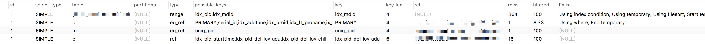

# mysql

<!-- TOC -->

- [mysql](#mysql)
  - [一、mysql是什么](#%e4%b8%80mysql%e6%98%af%e4%bb%80%e4%b9%88)
  - [二、mysql安装](#%e4%ba%8cmysql%e5%ae%89%e8%a3%85)
  - [三、mysql使用](#%e4%b8%89mysql%e4%bd%bf%e7%94%a8)
    - [1、数据库](#1%e6%95%b0%e6%8d%ae%e5%ba%93)
    - [2、数据表](#2%e6%95%b0%e6%8d%ae%e8%a1%a8)
    - [3、数据库CURD操作](#3%e6%95%b0%e6%8d%ae%e5%ba%93curd%e6%93%8d%e4%bd%9c)
  - [四、mysql视图](#%e5%9b%9bmysql%e8%a7%86%e5%9b%be)
  - [五、mysql索引](#%e4%ba%94mysql%e7%b4%a2%e5%bc%95)
  - [六、mysql事务](#%e5%85%admysql%e4%ba%8b%e5%8a%a1)
    - [1、原子性](#1%e5%8e%9f%e5%ad%90%e6%80%a7)
    - [2、一致性](#2%e4%b8%80%e8%87%b4%e6%80%a7)
    - [3、隔离性](#3%e9%9a%94%e7%a6%bb%e6%80%a7)
    - [4、持久性](#4%e6%8c%81%e4%b9%85%e6%80%a7)
    - [5、锁](#5%e9%94%81)
    - [6、总结](#6%e6%80%bb%e7%bb%93)
  - [七、存储过程](#%e4%b8%83%e5%ad%98%e5%82%a8%e8%bf%87%e7%a8%8b)
  - [八、触发器](#%e5%85%ab%e8%a7%a6%e5%8f%91%e5%99%a8)
  - [九、游标](#%e4%b9%9d%e6%b8%b8%e6%a0%87)
  - [十、mysql优化](#%e5%8d%81mysql%e4%bc%98%e5%8c%96)
    - [1、编码](#1%e7%bc%96%e7%a0%81)
    - [2、多列索引规则](#2%e5%a4%9a%e5%88%97%e7%b4%a2%e5%bc%95%e8%a7%84%e5%88%99)
    - [3、myisam和innodb索引区别](#3myisam%e5%92%8cinnodb%e7%b4%a2%e5%bc%95%e5%8c%ba%e5%88%ab)
    - [4、索引选择](#4%e7%b4%a2%e5%bc%95%e9%80%89%e6%8b%a9)
    - [5、分页优化](#5%e5%88%86%e9%a1%b5%e4%bc%98%e5%8c%96)
    - [6、索引与排序](#6%e7%b4%a2%e5%bc%95%e4%b8%8e%e6%8e%92%e5%ba%8f)
    - [7、explain使用](#7explain%e4%bd%bf%e7%94%a8)
      - [字段概述](#%e5%ad%97%e6%ae%b5%e6%a6%82%e8%bf%b0)
      - [id](#id)
      - [select_type](#selecttype)
      - [table](#table)
      - [type](#type)
      - [possible_keys](#possiblekeys)
      - [key](#key)
      - [key_len](#keylen)
      - [ref](#ref)
      - [rows](#rows)
      - [Extra](#extra)
  - [十、docker实现mysql主从复制](#%e5%8d%81docker%e5%ae%9e%e7%8e%b0mysql%e4%b8%bb%e4%bb%8e%e5%a4%8d%e5%88%b6)
  - [十一、参考资料](#%e5%8d%81%e4%b8%80%e5%8f%82%e8%80%83%e8%b5%84%e6%96%99)

<!-- /TOC -->

## 一、mysql是什么

MySQL（官方发音为/maɪ ˌɛskjuːˈɛl/“My S-Q-L”，但也经常读作/maɪ ˈsiːkwəl/“My Sequel”）原本是一个开放源代码的关系数据库管理系统，原开发者为瑞典的MySQL AB公司，该公司于2008年被昇阳微系统（Sun Microsystems）收购。2009年，甲骨文公司（Oracle）收购昇阳微系统公司，MySQL成为Oracle旗下产品。

## 二、mysql安装

Mac下直接`brew install mysql`，其余自行查阅资料进行安装

## 三、mysql使用

数据库：demo

数据表：user

字段：id int(11) | account varchar(255) | password varchar(255)

数据表：user_info

字段：id int(11) | uid int(11) | name varchar(255) | wx varchar(255)

### 1、数据库

```sql

# 创建数据库
create database `demo`;

# 查看所有数据库
show databases;

# 查看某个数据库
show create database `demo`;

# 修改数据库编码
alter database `demo` default character set utf8 collate utf8_unicode_ci;

# 删除数据库
drop database `demo`;
```

### 2、数据表

```sql

# 选择使用哪个数据库
use `demo`;

# 创建user表
CREATE TABLE `user` (
  `id` int(11) unsigned NOT NULL AUTO_INCREMENT,
  `account` varchar(255) NOT NULL,
  `password` varchar(255) NOT NULL,
  PRIMARY KEY (`id`)
) ENGINE=InnoDB DEFAULT CHARSET=utf8;

# 查看表字段名
desc `user`;

# 修改表名
alter table `user` rename to `users`;

# 修改字段名
alter table `user` change `account` `name` varchar(255) NOT NULL;

# 修改字段数据类型
alter table `user` modify `password` varchar(500) NOT NULL;

# 添加字段
alter table `user` add `uid` varchar(50) NOT NULL after `id`;

# 删除字段
alter table `user` drop `uid`;

# 修改字段位置
alter table `user` modify `password` varchar(500) first;
注：字段类型必须带上
alter table `user` modify `password` varchar(500) NOT NULL after `account`;

# 删除数据表
drop table `user`;
```

### 3、数据库CURD操作

```bash

# 添加数据
【单条数据】insert into `user` (account,password) values ('shengj','123456');
【批量】insert into `user` (account,password) values ('shengj','123456'),('wangm','123456');

# 更新数据
【单条数据】update `user` set password='123456789' where id=1;
【批量】update `user` set password='123456789' where id>1;

# 删除数据
【单条数据】delete from `user` where id=1;
【批量】delete from `user` where id>1;

# 查询
查询全部
select * from `user`;

查询某个字段
select `account` from `user`;

where条件查询
select * from `user` where id=1;

in/not in 关键字查询
select * from `user` where id in (1,2);
select * from `user` where id not in (1,2);

between and 关键字查询
select * from `user` where id between 1 and 3;

空值(null)查询，使用is null来判断
alter table `user` add `age` varchar(10) default null;
select * from `user` where age is null;

distinct(去重)关键字查询
select distinct(account) from `user`;

like关键字查询
select * from `user` where `account` like "%en%";

and关键字多条件查询,or关键字的使用也是类似
select * from `user` where `account`='shengj' and `id`>1;
select * from `user` where `account`='shengj' or  `account`='cenh';

# 聚合函数
count()函数 -> 记录总条数
sum()函数 -> 某个字段的总和
avg()函数 -> 字段的平均数
max()函数 -> 字段的最大值
min()函数 -> 字段的最小值

排序 order by
select * from `user` order by `id` desc; // 倒序
select * from `user` order by `id` asc; // 升序 默认

分组 group by
select * from `user` group by `id`;

使用limit限制查询结果的数量
select * from `user` limit 2;

别名 as
select u.id from `user` as u; // 表别名
select account as name from `user`; // 字段别名

联表 join
select i.name, i.wx, u.account
from `user` as u
inner join `user_info` as i on u.id = i.uid
where u.name = 'omgzui';
```

## 四、mysql视图

视图是虚拟的表，可以替代复杂sql查询

```sql
比如上面的
select i.name, i.wx, u.account
from `user` as u
inner join `user_info` as i on u.id = i.uid
where name = 'omgzui';
可以使用
select * from user_info_data where name = 'omgzui';

user_info_data就是视图

创建
create view user_info_data as
select i.name, i.wx, u.account
from `user` as u
inner join `user_info` as i on u.id = i.uid
where name = 'omgzui';

```

注意：

- 与创建表一样，创建视图的名称必须唯一
- 创建视图的个数并没限制，但是如果一张视图嵌套或者关联的表过多，同样会引发性能问题，在实际生产环节中部署时务必进行必要的性能检测。
- 在过滤条件数据时如果在创建视图的sql语句中存在where的条件语句，而在使用该视图的语句中也存在where条件语句时，这两个where条件语句会自动组合
- order by 可以在视图中使用，但如果从该视图检索数据的select语句中也含有order by ，那么该视图中的order by 将被覆盖。
- 视图中不能使用索引，也不能使用触发器
- 使用可以和普通的表一起使用，编辑一条联结视图和普通表的sql语句是允许的。

## 五、mysql索引

作用：提高表中数据的查询速度

1. 普通索引(单列索引)
2. 唯一索引
3. 全文索引
4. 多列索引(复合索引)
5. 主键索引

```sql

CREATE TABLE `love` (
  `id` int(11) unsigned NOT NULL AUTO_INCREMENT,
  `uid` varchar(50) NOT NULL,
  `name` varchar(200) NOT NULL,
  `quote` varchar(50) NOT NULL,
  `space` varchar(50) NOT NULL,
  PRIMARY KEY (`id`), # 主键索引
  INDEX (`uid`), # 普通索引
  UNIQUE INDEX unique_name(`name`), # 唯一索引
  FULLTEXT INDEX fulltext_quote(`quote`), # 全文索引
  INDEX multi(id,space(20)) # 多列索引
) ENGINE=InnoDB DEFAULT CHARSET=utf8;

```

索引设计：

- where子句中的列可能最适合做为索引
- 不要尝试为性别或者有无这类字段等建立索引(因为类似性别的列，一般只含有`0`和`1`，无论搜索结果如何都会大约得出一半的数据)
- 如果创建复合索引，要遵守`最左前缀`法则。即查询从索引的最左前列开始，并且不跳过索引中的列
- 不要过度使用索引。每一次的更新，删除，插入都会维护该表的索引，更多的索引意味着占用更多的空间
- 使用InnoDB存储引擎时，记录(行)默认会按照一定的顺序存储，如果已定义主键，则按照主键顺序存储，由于普通索引都会保存主键的键值，因此主键应尽可能的选择较短的数据类型，以便节省存储空间
- 不要尝试在索引列上使用函数。

## 六、mysql事务

mysql事务可以理解为一系列操作，要么成功执行，要么失败。

```sql
-- 声明事务的开始
BEGIN(或START TRANSACTION);

-- 提交整个事务
COMMIT;

-- 回滚到事务初始状态
ROLLBACK;
```

四个特性ACID

- atomicity  原子性
- consistency 一致性
- isolation 隔离性
- durability 持久性

### 1、原子性

下图可以很好的描述事务的原子性：事务要不就在执行中，要不然就是成功或者失败的状态


### 2、一致性

如果一个事务原子地在一个一致地数据库中独立运行，那么在它执行之后，数据库的状态一定是一致的。对于这个概念，它的第一层意思就是对于数据完整性的约束，包括主键约束、引用约束以及一些约束检查等等，在事务的执行的前后以及过程中不会违背对数据完整性的约束，所有对数据库写入的操作都应该是合法的，并不能产生不合法的数据状态。

### 3、隔离性

如果所有的事务的执行顺序都是线性的，那么对于事务的管理容易得多，但是允许事务的并行执行却能能够提升吞吐量和资源利用率，并且可以减少每个事务的等待时间。

### 4、持久性

事务的持久性就体现在，一旦事务被提交，那么数据一定会被写入到数据库中并持久存储起来。

### 5、锁

关于锁的锁定，对于UPDATE、DELETE和INSERT语句，InnoDB会自动给涉及数据集加排他锁（X)；对于普通SELECT语句，InnoDB不会加任何锁

### 6、总结

事务的 ACID 四大基本特性是保证数据库能够运行的基石，但是完全保证数据库的 ACID，尤其是隔离性会对性能有比较大影响，在实际的使用中我们也会根据业务的需求对隔离性进行调整，除了隔离性，数据库的原子性和持久性相信都是比较好理解的特性，前者保证数据库的事务要么全部执行、要么全部不执行，后者保证了对数据库的写入都是持久存储的、非易失的，而一致性不仅是数据库对本身数据的完整性的要求，同时也对开发者提出了要求 - 写出逻辑正确并且合理的事务。

## 七、存储过程

存储过程就是数据库中保存的一系列SQL命令的集合

栗子1：参数的种类分3种，分别是IN、OUT、INOUT，其中IN为输入参数类型，OUT为输出参数类型，而INOUT既是输入类型又是输出类型，下面我们创建一个存储过程，以达到对user表的用户名称进行模糊查询的目的，存储过程名称为sp_search_user

```sql
-- 改变分隔符
DELIMITER //
-- 创建存储过程
create procedure sp_search_user (in name varchar(20));
    begin
    if name is null or name='' then
        select * from user;
    else
        select * from user where username like name;
    end if;
    end
    //
DELIMITER ; -- 恢复分隔符

-- name传入null值，查询所有用户。
call sp_search_user(null);
call sp_search_user('%omg%');
```

栗子2：关键字OUT则是指明相应参数用来从存储过程传出的一个值,也可以理解为存储过程的返回值，而对于INOUT则是两者结合体。现在我们创建一个存储过程，用于返回商品的最大值、最小值和平均值，命名为sp_item_price

```sql
DELIMITER //
-- 创建存储过程
create procedure sp_item_price(out plow decimal(8,2),
                                out phigh decimal(8,2),
                                out pavg decimal(8,2))
    begin
       select min(price) into plow from items;
       select max(price) into phigh from items;
       select avg(price) into pavg from items;
    end;
    //
DELIMITER ; -- 恢复分隔符
-- 调用存储过程
call sp_item_price(@pricelow,@pricehigh,@priceavg);
-- 查询执行结果
select @pricelow;
select @pricehigh;
select @priceavg;
```

## 八、触发器

触发器可以简单理解一种特殊的存储过程

```sql
DELIMITER //
-- 创建触发器
create trigger trg_user_history after delete
    on user
    for each row
    begin
      insert into user_history(uid,name,pinyin,birth,sex,address,updated)
      values(OLD.id,OLD.name,OLD.pinyin,OLD.birth,OLD.sex,OLD.address,NOW());
    end
    //
DELIMITER ;

trg_user_history 触发器名字
after 触发时间
delete 触发事件
user 需要触发的表
for each row 固定写法

上述sql中创建语句的形式与前面的存储过程或者存储函数都很类似，这里有点要注意的是，使用OLD/NEW关键字可以获取数据变更前后的记录，其中OLD用于AFTER时刻，而NEW用于BEFORE时刻的变更。如OLD.name表示从user表删除的记录的名称。INSERT操作一般使用NEW关键字，UPDATE操作一般使用NEW和OLD，而DELETE操作一般使用OLD。
```

## 九、游标

游标就就是可以将检索出来的数据集合保存在内存中然后依次取出每条数据进行处理

```sql
-- 声明游标
DECLARE cursor_name CURSOR FOR SELECT 语句;
-- 打开游标
OPEN cursor_name;
-- 从游标指针中获取数据
FETCH cursor_name INTO 变量名 [,变量名2,...];
-- 关闭游标
CLOSE cursor_name
```

## 十、mysql优化

### 1、编码

```sql
# 查看mysql编码
show variables like 'character%';
+--------------------------+----------------------------+
| Variable_name            | Value                      |
+--------------------------+----------------------------+
| character_set_client     | utf8mb4                    | 客户端来源数据使用的字符集
| character_set_connection | utf8mb4                    | 连接层字符集
| character_set_database   | utf8                       | 当前选中数据库的默认字符集
| character_set_results    | utf8mb4                    | 查询结果字符集
| character_set_server     | latin1                     | 默认的内部操作字符集
| character_set_system     | utf8                       | 系统元数据(字段名等)字符集
+--------------------------+----------------------------+
8 rows in set (0.01 sec)

# 字符集
utf8、utf8mb4
要在Mysql中保存4字节长度的UTF-8字符，需要使用utf8mb4字符集，但只有 5.5.3 版本以后的才支持(查看版本：select version();)。我觉得，为了获取更好的兼容性，应该总是使用utf8mb4而非utf8. 对于CHAR类型数据，utf8mb4会多消耗一些空间，根据Mysql官方建议，使用VARCHAR替代CHAR。

# 排序规则
_ci、_bin
_ci表示大小写不敏感
_bin表示按编码值比较

```

### 2、多列索引规则

左前缀规则

举例：index(a,b,c)

| 条件                                   | 索引是否发挥作用 | 用了哪些列                 |
| -------------------------------------- | ---------------- | -------------------------- |
| Where a=3                              | 是               | 只使用了a列                |
| Where a=3 and b=5                      | 是               | 使用了a,b列                |
| Where a=3 and b=5 and c=4              | 是               | 使用了abc                  |
| Where b=3  or  where c=4               | 否               |
| Where a=3 and c=4                      | 是               | a列能发挥索引,c不能        |
| Where a=3 and b>10 and c=7             | 是               | a能利用,b能利用, c不能利用 |
| where a=3 and b like ‘xxxx%’ and c=7 | 是               | a能用,b能用,c不能用        |

### 3、myisam和innodb索引区别

描述

- myisam主索引和次索引都指向物理行，比如id指向了物理行，由索引到磁盘拿数据（回行）
- innodb的主索引行上直接存储行的数据，称为聚簇索引，次索引指向主索引，比如id行包括了name、age等等数据，name包括了id

聚簇索引缺点：节点分裂，行数据搬运缓慢，因此尽量用递增整形做索引
myisam则分裂较快

索引覆盖：查找的字段正好是索引，速度快

### 4、索引选择

1. 查询频繁
2. 区分度高
3. 长度小 比如在word字段上设索引，最短长度为2，最长为14，需要测试覆盖率，count(left(word, 4))/count(*)
4. 尽量能覆盖常用查询字段

### 5、分页优化

- 使用where id > 5000000 limit 10  => limit 5000000,10
  - 这样的做法是会走id主键索引，速度是非常快的
  - 需要id连续，因为逻辑删除数据
- 延迟关联，先取索引数据，再由索引到磁盘拿数据（回行）
  - select id,name from lx limit 5000000,10 => select lx.id,name from lx inner join (select id
  - from lx limit 5000000,10) as tmp on lx.id = tmp.id

### 6、索引与排序

1. 对于覆盖索引,直接在索引上查询时,就是有顺序的, using index
2. 先取出数据,形成临时表做filesort(文件排序,但文件可能在磁盘上,也可能在内存中)

我们的争取目标-----取出来的数据本身就是有序的! 利用索引来排序.

### 7、explain使用



```sql
explain SELECT
    p.id,
    b.STATUS,
    b.adultprice,
    m.minprice AS minprice,
    m.is_free AS is_free,
    m.price_status AS price_status,
    min( b.starttime ) AS starttime,
    p.class_region_id,
    p.weight,
    p.product_name
FROM
    p AS p
    LEFT JOIN b AS b ON p.id = b.pid
    LEFT JOIN m AS m ON p.id = m.pid
WHERE
    p.deleted = '0'
    AND p.is_over = '0'
    AND p.is_show = '1'
    AND b.is_over = '0'
    AND b.deleted = '0'
    AND p.id IN (SELECT pid FROM r WHERE mdd_id IN (5523) )
GROUP BY
    p.id
ORDER BY
    price_status ASC,
    p.class_region_id ASC,
    p.weight DESC,
    starttime ASC ,
    p.id asc
    LIMIT 0,8
```

#### 字段概述

| 列名          | 说明                                                         |
| ------------- | ------------------------------------------------------------ |
| id            | 执行编号，标识select所属的行。如果在语句中没子查询或关联查询，只有唯一的select，每行都将显示1。否则，内层的select语句一般会顺序编号，对应于其在原始语句中的位置 |
| select_type   | 显示本行是简单或复杂select。如果查询有任何复杂的子查询，则最外层标记为PRIMARY（DERIVED、UNION、UNION RESUlT） |
| table         | 访问引用哪个表（引用某个查询，如“derived3”）                 |
| type          | 数据访问/读取操作类型（ALL、index、range、ref、eq_ref、const/system、NULL） |
| possible_keys | 揭示哪一些索引可能有利于高效的查找                           |
| key           | 显示mysql决定采用哪个索引来优化查询                          |
| key_len       | 显示mysql在索引里使用的字节数                                |
| ref           | 显示了之前的表在key列记录的索引中查找值所用的列或常量        |
| rows          | 为了找到所需的行而需要读取的行数，估算值，不精确。通过把所有rows列值相乘，可粗略估算整个查询会检查的行数 |
| Extra         | 额外信息，如using index、filesort等                          |

#### id

id是用来顺序标识整个查询中SELELCT 语句的，在嵌套查询中id越大的语句越先执行。该值可能为NULL，如果这一行用来说明的是其他行的联合结果。

#### select_type

表示查询的类型

| 类型               | 说明                                                         |
| ------------------ | ------------------------------------------------------------ |
| simple             | 简单子查询，不包含子查询和union                              |
| primary            | 包含union或者子查询，最外层的部分标记为primary               |
| subquery           | 一般子查询中的子查询被标记为subquery，也就是位于select列表中的查询 |
| derived            | 派生表——该临时表是从子查询派生出来的，位于form中的子查询     |
| union              | 位于union中第二个及其以后的子查询被标记为union，第一个就被标记为primary如果是union位于from中则标记为derived |
| union result       | 用来从匿名临时表里检索结果的select被标记为union result       |
| dependent union    | 顾名思义，首先需要满足UNION的条件，及UNION中第二个以及后面的SELECT语句，同时该语句依赖外部的查询 |
| subquery           | 子查询中第一个SELECT语句                                     |
| dependent subquery | 和DEPENDENT UNION相对UNION一样                               |

#### table

对应行正在访问哪一个表，表名或者别名

- 关联优化器会为查询选择关联顺序，左侧深度优先
- 当from中有子查询的时候，表名是derivedN的形式，N指向子查询，也就是explain结果中的下一列
- 当有union result的时候，表名是union 1,2等的形式，1,2表示参与union的query id

注意：MySQL对待这些表和普通表一样，但是这些“临时表”是没有任何索引的。

#### type

type显示的是访问类型，是较为重要的一个指标，结果值从好到坏依次是：
 system > const > eq_ref > ref > fulltext > ref_or_null > index_merge > unique_subquery > index_subquery > range > index > ALL ，一般来说，得保证查询至少达到range级别，最好能达到ref。

| 类型   | 说明                                                         |
| ------ | ------------------------------------------------------------ |
| All    | 最坏的情况,全表扫描                                          |
| index  | 和全表扫描一样。只是扫描表的时候按照索引次序进行而不是行。主要优点就是避免了排序, 但是开销仍然非常大。如在Extra列看到Using index，说明正在使用覆盖索引，只扫描索引的数据，它比按索引次序全表扫描的开销要小很多 |
| range  | 范围扫描，一个有限制的索引扫描。key 列显示使用了哪个索引。当使用=、 <>、>、>=、<、<=、IS NULL、<=>、BETWEEN 或者 IN 操作符,用常量比较关键字列时,可以使用 range |
| ref    | 一种索引访问，它返回所有匹配某个单个值的行。此类索引访问只有当使用非唯一性索引或唯一性索引非唯一性前缀时才会发生。这个类型跟eq_ref不同的是，它用在关联操作只使用了索引的最左前缀，或者索引不是UNIQUE和PRIMARY KEY。ref可以用于使用=或<=>操作符的带索引的列。 |
| eq_ref | 最多只返回一条符合条件的记录。使用唯一性索引或主键查找时会发生 （高效） |
| const  | 当确定最多只会有一行匹配的时候，MySQL优化器会在查询前读取它而且只读取一次，因此非常快。当主键放入where子句时，mysql把这个查询转为一个常量（高效） |
| system | 这是const连接类型的一种特例，表仅有一行满足条件。            |
| Null   | 意味说mysql能在优化阶段分解查询语句，在执行阶段甚至用不到访问表或索引（高效） |

#### possible_keys

显示查询使用了哪些索引，表示该索引可以进行高效地查找，但是列出来的索引对于后续优化过程可能是没有用的

#### key

key列显示MySQL实际决定使用的键（索引）。如果没有选择索引，键是NULL。要想强制MySQL使用或忽视possible_keys列中的索引，在查询中使用FORCE INDEX、USE INDEX或者IGNORE INDEX。

#### key_len

key_len列显示MySQL决定使用的键长度。如果键是NULL，则长度为NULL。使用的索引的长度。在不损失精确性的情况下，长度越短越好 。

#### ref

ref列显示使用哪个列或常数与key一起从表中选择行。

#### rows

rows列显示MySQL认为它执行查询时必须检查的行数。注意这是一个预估值。

#### Extra

Extra是EXPLAIN输出中另外一个很重要的列，该列显示MySQL在查询过程中的一些详细信息，MySQL查询优化器执行查询的过程中对查询计划的重要补充信息。

| 类型                         | 说明                                                         |
| ---------------------------- | ------------------------------------------------------------ |
| Using filesort               | MySQL有两种方式可以生成有序的结果，通过排序操作或者使用索引，当Extra中出现了Using filesort 说明MySQL使用了后者，但注意虽然叫filesort但并不是说明就是用了文件来进行排序，只要可能排序都是在内存里完成的。大部分情况下利用索引排序更快，所以一般这时也要考虑优化查询了。使用文件完成排序操作，这是可能是ordery by，group by语句的结果，这可能是一个CPU密集型的过程，可以通过选择合适的索引来改进性能，用索引来为查询结果排序。 |
| Using temporary              | 用临时表保存中间结果，常用于GROUP BY 和 ORDER BY操作中，一般看到它说明查询需要优化了，就算避免不了临时表的使用也要尽量避免硬盘临时表的使用。 |
| Not exists                   | MYSQL优化了LEFT JOIN，一旦它找到了匹配LEFT JOIN标准的行， 就不再搜索了。 |
| Using index                  | 说明查询是覆盖了索引的，不需要读取数据文件，从索引树（索引文件）中即可获得信息。如果同时出现using where，表明索引被用来执行索引键值的查找，没有using where，表明索引用来读取数据而非执行查找动作。这是MySQL服务层完成的，但无需再回表查询记录。 |
| Using index condition        | 这是MySQL 5.6出来的新特性，叫做“索引条件推送”。简单说一点就是MySQL原来在索引上是不能执行如like这样的操作的，但是现在可以了，这样减少了不必要的IO操作，但是只能用在二级索引上。 |
| Using where                  | 使用了WHERE从句来限制哪些行将与下一张表匹配或者是返回给用户。**注意**：Extra列出现Using where表示MySQL服务器将存储引擎返回服务层以后再应用WHERE条件过滤。 |
| Using join buffer            | 使用了连接缓存：**Block Nested Loop**，连接算法是块嵌套循环连接;**Batched Key Access**，连接算法是批量索引连接 |
| impossible where             | where子句的值总是false，不能用来获取任何元组                 |
| select tables optimized away | 在没有GROUP BY子句的情况下，基于索引优化MIN/MAX操作，或者对于MyISAM存储引擎优化COUNT(*)操作，不必等到执行阶段再进行计算，查询执行计划生成的阶段即完成优化。 |
| distinct                     | 优化distinct操作，在找到第一匹配的元组后即停止找同样值的动作 |

## 十、docker实现mysql主从复制

[docker实现mysql主从复制](https://github.com/OMGZui/mysql_m_s)

```bash
# 准备容器
docker pull mysql:5.5

# 目录
├── LICENSE
├── README.md
├── docker-compose.yml
├── master
│   ├── Dockerfile
│   ├── docker-entrypoint-initdb.d
│   │   └── init.sql
│   └── my.cnf
├── slave1
│   ├── Dockerfile
│   ├── docker-entrypoint-initdb.d
│   │   └── init.sql
│   └── my.cnf
└── slave2
    ├── Dockerfile
    ├── docker-entrypoint-initdb.d
    │   └── init.sql
    └── my.cnf

# 启动
docker-compose up -d master slave1 slave2

# 主容器
# GRANT REPLICATION SLAVE ON *.* to 'backup'@'%' identified by 'backup';
# flush master;
docker-compose exec master /bin/bash
mysql -u root -p < docker-entrypoint-initdb.d/init.sql

# 从容器
# stop slave;
# flush slave;
# CHANGE MASTER TO MASTER_HOST='master', MASTER_PORT=3306, MASTER_USER='backup', MASTER_PASSWORD='backup';
# START SLAVE;

# 从容器1
docker-compose exec slave1 /bin/bash
mysql -u root -p < docker-entrypoint-initdb.d/init.sql

# 从容器2
docker-compose exec slave2 /bin/bash
mysql -u root -p < docker-entrypoint-initdb.d/init.sql

```

## 十一、参考资料

- [mysql基本操作命令汇总](http://www.jianshu.com/p/118e1c41e9f0)
- [『浅入深出』MySQL 中事务的实现](http://draveness.me/mysql-transaction.html)
- [MySQL的初次见面礼基础实战篇](https://blog.csdn.net/javazejian/article/details/61614366)
- [MySQL的进阶实战篇](https://blog.csdn.net/javazejian/article/details/69857949)
- [基于Docker搭建MySQL主从复制](https://my.oschina.net/u/3773384/blog/1810111?p=1)
