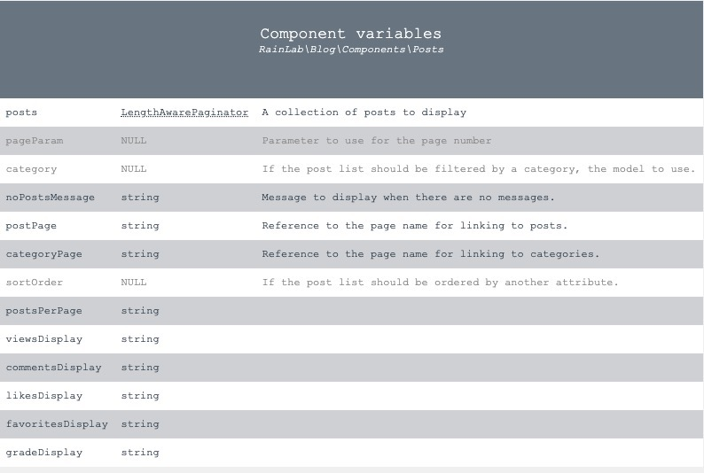
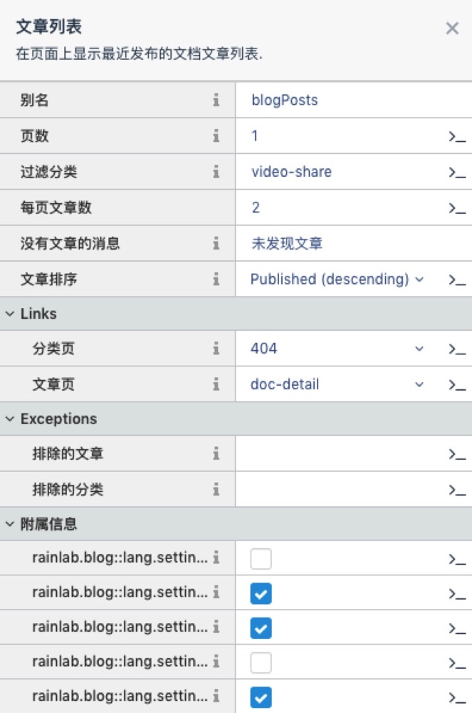

# October

## blogPosts文章组件



- viewsDisplay  `显示浏览量`
- commentsDisplay  `显示评论数`  对应组件 comments
- likesDisplay  `显示点赞数`  对应组件 like
- favoritesDisplay  `显示收藏数`  对应组件 blogFavorite
- gradeDisplay  `显示评分`  对应组件 blogGrade

附加：shareDisplay  `显示分享按钮`



## 插件的配置

两种方式：后端设置表单[推荐]和配置文件

## October 插件原理

```php
    public function runPage($page, $useAjax = true)
    {
        $this->page = $page;

        // 页面没有layout，就给他一个默认layout，否则就用自定义layout
        if (!$page->layout) {
            $layout = Layout::initFallback($this->theme);
        }
        elseif (($layout = Layout::loadCached($this->theme, $page->layout)) === null) {
            throw new CmsException(Lang::get('cms::lang.layout.not_found_name', ['name'=>$page->layout]));
        }

        $this->layout = $layout;

        // 给页面变量this赋值
        $this->vars['this'] = [
            'page'        => $this->page,
            'layout'      => $this->layout,
            'theme'       => $this->theme,
            'param'       => $this->router->getParameters(),
            'controller'  => $this,
            'environment' => App::environment(),
            'session'     => App::make('session'),
        ];

        // 检查session错误
        $this->vars['errors'] = (Config::get('session.driver') && Session::has('errors'))
            ? Session::get('errors')
            : new \Illuminate\Support\ViewErrorBag;

        // 处理ajax请求，并且执行生命周期方法
        $this->initCustomObjects();

        $this->initComponents();

        /*
         * Give the layout and page an opportunity to participate
         * after components are initialized and before AJAX is handled.
         */
        if ($this->layoutObj) {
            CmsException::mask($this->layout, 300);
            $this->layoutObj->onInit();
            CmsException::unmask();
        }

        CmsException::mask($this->page, 300);
        $this->pageObj->onInit();
        CmsException::unmask();

        /**
         * @event cms.page.init
         * Provides an opportunity to return a custom response from Controller->runPage() before AJAX handlers are executed
         *
         * Example usage:
         *
         *     Event::listen('cms.page.init', function ((\Cms\Classes\Controller) $controller, (\Cms\Classes\Page) $page) {
         *         return \Cms\Classes\Page::loadCached('trick-theme-code', 'page-file-name');
         *     });
         *
         * Or
         *
         *     $CmsController->bindEvent('page.init', function ((\Cms\Classes\Page) $page) {
         *         return \Cms\Classes\Page::loadCached('trick-theme-code', 'page-file-name');
         *     });
         *
         */
        if ($event = $this->fireSystemEvent('cms.page.init', [$page])) {
            return $event;
        }

        /*
         * Execute AJAX event
         */
        if ($useAjax && $ajaxResponse = $this->execAjaxHandlers()) {
            return $ajaxResponse;
        }

        /*
         * Execute postback handler
         */
        if (
            $useAjax &&
            ($handler = post('_handler')) &&
            $this->verifyCsrfToken() &&
            ($handlerResponse = $this->runAjaxHandler($handler)) &&
            $handlerResponse !== true
        ) {
            return $handlerResponse;
        }

        /*
         * Execute page lifecycle
         */
        if ($cycleResponse = $this->execPageCycle()) {
            return $cycleResponse;
        }

        /**
         * @event cms.page.beforeRenderPage
         * Fires after AJAX handlers are dealt with and provides an opportunity to modify the page contents
         *
         * Example usage:
         *
         *     Event::listen('cms.page.beforeRenderPage', function ((\Cms\Classes\Controller) $controller, (\Cms\Classes\Page) $page) {
         *         return 'Custom page contents';
         *     });
         *
         * Or
         *
         *     $CmsController->bindEvent('page.beforeRenderPage', function ((\Cms\Classes\Page) $page) {
         *         return 'Custom page contents';
         *     });
         *
         */
        if ($event = $this->fireSystemEvent('cms.page.beforeRenderPage', [$page])) {
            $this->pageContents = $event;
        }
        else {
            /*
             * Render the page
             */
            CmsException::mask($this->page, 400);
            $this->loader->setObject($this->page);
            $template = $this->twig->loadTemplate($this->page->getFilePath());
            $this->pageContents = $template->render($this->vars);
            CmsException::unmask();
        }

        /*
         * Render the layout
         */
        CmsException::mask($this->layout, 400);
        $this->loader->setObject($this->layout);
        $template = $this->twig->loadTemplate($this->layout->getFilePath());
        $result = $template->render($this->vars);
        CmsException::unmask();

        return $result;
    }

```

## Laravel 容器原理

```php
    public function __construct($basePath = null)
    {
        // basePath = /var/www/laravel
        if ($basePath) {
            $this->setBasePath($basePath);
        }
        // bindings[]
        $this->registerBaseBindings();
        // serviceProviders[]
        // loadedProviders[]
        $this->registerBaseServiceProviders();
        // aliases[]
        // abstractAliases[]
        $this->registerCoreContainerAliases();
    }

    public function send()
    {
        $this->sendHeaders();
        $this->sendContent();

        if (function_exists('fastcgi_finish_request')) {
            fastcgi_finish_request();
        } elseif ('cli' !== PHP_SAPI) {
            static::closeOutputBuffers(0, true);
        }

        return $this;
    }

    public function sendContent()
    {
        echo $this->content;

        return $this;
    }

```

## Laravel 服务提供者原理

```php
    public function register($provider, $options = [], $force = false)
    {
        if (($registered = $this->getProvider($provider)) && ! $force) {
            return $registered;
        }

        // 字符串就解析出实例
        if (is_string($provider)) {
            $provider = $this->resolveProvider($provider);
        }

        // 执行服务提供者中的register方法
        if (method_exists($provider, 'register')) {
            $provider->register();
        }

        $this->markAsRegistered($provider);

        // If the application has already booted, we will call this boot method on
        // the provider class so it has an opportunity to do its boot logic and
        // will be ready for any usage by this developer's application logic.
        if ($this->booted) {
            $this->bootProvider($provider);
        }

        return $provider;
    }

```

## October ajax 原理

`POST`  backend/cms/themes

```php
    # 入口
    $app = {October\Rain\Foundation\Application}
    $kernel = {October\Rain\Foundation\Http\Kernel}
    $request = {Illuminate\Http\Request}

    # 处理http请求
    public function handle($request){
        return (new Pipeline($this->app))
            ->send($request)
            ->through($this->app->shouldSkipMiddleware() ? [] : $this->middleware)
            ->then($this->dispatchToRouter());
    }
    public function handle($request, Closure $next){
        return $next($request);
    }
    public function dispatch(Request $request)
    {
        $this->currentRequest = $request;
        // 处理route前事件
        $this->events->fire('router.before', [$request]);
        // 处理route
        $response = $this->dispatchToRoute($request);
        // 处理route后事件
        $this->events->fire('router.after', [$request, $response]);
        return $response;
    }
    protected function runRouteWithinStack(Route $route, Request $request)
    {
        $shouldSkipMiddleware = $this->container->bound('middleware.disable') &&
                                $this->container->make('middleware.disable') === true;
        // 0 = "October\Rain\Cookie\Middleware\EncryptCookies"
        // 1 = "Illuminate\Cookie\Middleware\AddQueuedCookiesToResponse"
        // 2 = "Illuminate\Session\Middleware\StartSession"
        // 3 = "Illuminate\View\Middleware\ShareErrorsFromSession"
        // 4 = "Illuminate\Routing\Middleware\SubstituteBindings"
        // 5 = "Backend\Classes\BackendController" $this->middleware(function ($request, $next) {})
        $middleware = $shouldSkipMiddleware ? [] : $this->gatherRouteMiddleware($route);
        // 队列处理中间件
        return (new Pipeline($this->container))
                        ->send($request)
                        ->through($middleware)
                        ->then(function ($request) use ($route) {
                            return $this->prepareResponse(
                                $request, $route->run()
                            );
                        });
    }
    // return $controller->callAction($method, $parameters);
    public function callAction($method, $parameters)
    {
        // $controller = {Backend\Classes\BackendController} [10]
        // $method = "run"
        // $parameters = {array} ["cms/themes"]
        return call_user_func_array([$this, $method], $parameters);
    }
    // 控制器中重要的run
    public function run($url = null)
    {
        // 0 = "cms"
        // 1 = "themes"
        $params = RouterHelper::segmentizeUrl($url);

        // $controllerRequest = {array} [3]
        // controller = {Cms\Controllers\Themes} [32]
        // action = "index"
        // params = {array} [0]
        $controllerRequest = $this->getRequestedController($url);
        if (!is_null($controllerRequest)) {
            return $controllerRequest['controller']->run(
                $controllerRequest['action'],
                $controllerRequest['params'] // 执行modules/backend/classes/Controller.php  run()
            );
        }

        return $this->passToCmsController($url);
    }

    /*
    * Execute AJAX event
    */
    if ($ajaxResponse = $this->execAjaxHandlers()) {
        return $ajaxResponse;
    }
    // onSetActiveTheme
    $handler = $this->getAjaxHandler()
    // $pageHandler = "index_onSetActiveTheme"
    $result = $this->runAjaxHandler($handler) = call_user_func_array([$this, $pageHandler], $this->params)
    // 定位到具体执行方法
    public function index_onSetActiveTheme()
    {
        CmsTheme::setActiveTheme(post('theme'));

        return [
            '#theme-list' => $this->makePartial('theme_list')
        ];
    }
```

## October 存储数据 原理，随带提下Laravel存储原理

```php
    // $key = "cms::theme.active"
    // $value = "omgzui"
    Parameter::set(self::ACTIVE_KEY, $code);
    public static function set($key, $value = null)
    {
        if (is_array($key)) {
            foreach ($key as $_key => $_value) {
                static::set($_key, $_value);
            }
            return true;
        }

        // table = "system_parameters"
        $record = static::findRecord($key);
        if (!$record) {
            $record = new static;
            list($namespace, $group, $item) = $record->parseKey($key);
            $record->namespace = $namespace; // cms
            $record->group = $group; // theme
            $record->item = $item; // active
        }
        // public function __set($key, $value){$this->setAttribute($key, $value);}
        $record->value = $value;
        // omgzui
        $record->save(); // 进入Laravel

        static::$cache[$key] = $value;
        return true;
    }

    // 保存 update `system_parameters` set `value` = "omgzui" where `id` = 5
    public function save(array $options = [])
    {
        // Get a new query builder instance for the connection.
        $query = $this->newModelQuery();

        // 执行失败就直接返回false
        if ($this->fireModelEvent('saving') === false) {
            return false;
        }

        // 已经存在就更新
        if ($this->exists) {
            $saved = $this->isDirty() ? $this->performUpdate($query) : true;
        }

        // 不存在就新增，按自增ID
        else {
            $saved = $this->performInsert($query);

            if (! $this->getConnectionName() &&
                $connection = $query->getConnection()) {
                $this->setConnection($connection->getName());
            }
        }

        // 成功之后完成一些附加操作
        if ($saved) {
            $this->finishSave($options);
        }

        return $saved;
    }
    // 获取数据库连接实例
    public function connection($name = null)
    {
        list($database, $type) = $this->parseConnectionName($name);
        $name = $name ?: $database;
        // 还没有连接实例就创建一个
        if (! isset($this->connections[$name])) {
            $this->connections[$name] = $this->configure(
                $this->makeConnection($database), $type
            );
        }
        return $this->connections[$name];
    }

    // 查询构建实例
    protected function newBaseQueryBuilder()
    {
        $conn = $this->getConnection();
        $grammar = $conn->getQueryGrammar();
        $builder = new QueryBuilder($conn, $grammar, $conn->getPostProcessor());
        if ($this->duplicateCache) {
            $builder->enableDuplicateCache();
        }
        return $builder;
    }
    // 通过比较原始数据和post数据返回改变的数据
    public function getDirty()
    {
        $dirty = [];
        foreach ($this->getAttributes() as $key => $value) {
            if (! $this->originalIsEquivalent($key, $value)) {
                $dirty[$key] = $value;
            }
        }
        return $dirty;
    }
    // 拼接sql
    // $boolean = "and"
    // $column = "id"
    // $operator = "="
    // $value = {int} 5
    public function where($column, $operator = null, $value = null, $boolean = 'and')
    {
        if ($column instanceof Closure) {
            $column($query = $this->model->newModelQuery());
            $this->query->addNestedWhereQuery($query->getQuery(), $boolean);
        } else {
            $this->query->where(...func_get_args());
        }
        return $this;
    }

    // $this->query->where(...func_get_args());
    public function where($column, $operator = null, $value = null, $boolean = 'and')
    {
        // 处理字段数组
        if (is_array($column)) {
            return $this->addArrayOfWheres($column, $boolean);
        }

        // 处理操作符
        list($value, $operator) = $this->prepareValueAndOperator(
            $value, $operator, func_num_args() == 2
        );

        // 处理字段闭包
        if ($column instanceof Closure) {
            return $this->whereNested($column, $boolean);
        }

        // 给省略操作符的默认加上 "="
        if ($this->invalidOperator($operator)) {
            list($value, $operator) = [$operator, '='];
        }

        // 值是闭包。处理子查询
        if ($value instanceof Closure) {
            return $this->whereSub($column, $operator, $value, $boolean);
        }

        // 值为空，默认为null
        if (is_null($value)) {
            return $this->whereNull($column, $boolean, $operator !== '=');
        }

        // 处理字段是json格式
        if (Str::contains($column, '->') && is_bool($value)) {
            $value = new Expression($value ? 'true' : 'false');
        }

        // 简单查询whereBasic，主要是区分whereIn、whereNull这种
        $type = 'Basic';
        $this->wheres[] = compact(
            'type', 'column', 'operator', 'value', 'boolean'
        );
        if (! $value instanceof Expression) {
            $this->addBinding($value, 'where');
        }
        return $this;
    }

    // 更新
    public function update(array $values)
    {
        // $sql = rtrim("update {$table}{$joins} set $columns $where");
        // update `system_parameters` set `value` = ? where `id` = ?
        $sql = $this->grammar->compileUpdate($this, $values);

        return $this->connection->update($sql, $this->cleanBindings(
            $this->grammar->prepareBindingsForUpdate($this->bindings, $values)
        ));
    }

    // 多维数组变一维
    public static function flatten($array, $depth = INF)
    {
        $result = [];
        foreach ($array as $item) {
            $item = $item instanceof Collection ? $item->all() : $item;
            if (! is_array($item)) {
                $result[] = $item;
            } elseif ($depth === 1) {
                $result = array_merge($result, array_values($item));
            } else {
                $result = array_merge($result, static::flatten($item, $depth - 1));
            }
        }
        return $result;
    }

    // SQL最终执行
    // $bindings = {array} [2]
    // 0 = ""omgzui""
    // 1 = {int} 5
    // $query = "update `system_parameters` set `value` = ? where `id` = ?"
    public function affectingStatement($query, $bindings = [])
    {
        return $this->run($query, $bindings, function ($query, $bindings) {
            if ($this->pretending()) {
                return 0;
            }
            // 声明语句
            $statement = $this->getPdo()->prepare($query);
            // 语句预处理绑定
            $this->bindValues($statement, $this->prepareBindings($bindings));
            $statement->execute();
            // 修改了几条数据
            $this->recordsHaveBeenModified(
                ($count = $statement->rowCount()) > 0
            );
            return $count;
        });
    }
    protected function run($query, $bindings, Closure $callback)
    {
        $this->reconnectIfMissingConnection();
        $start = microtime(true);
        // 重连机制
        try {
            $result = $this->runQueryCallback($query, $bindings, $callback);
        } catch (QueryException $e) {
            $result = $this->handleQueryException(
                $e, $query, $bindings, $callback
            );
        }
        // 记录日志，同时广播
        $this->logQuery(
            $query, $bindings, $this->getElapsedTime($start)
        );
        return $result;
    }
```
