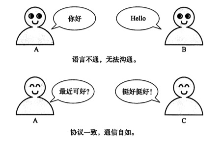
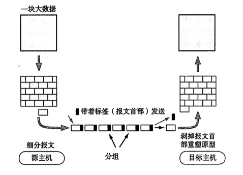
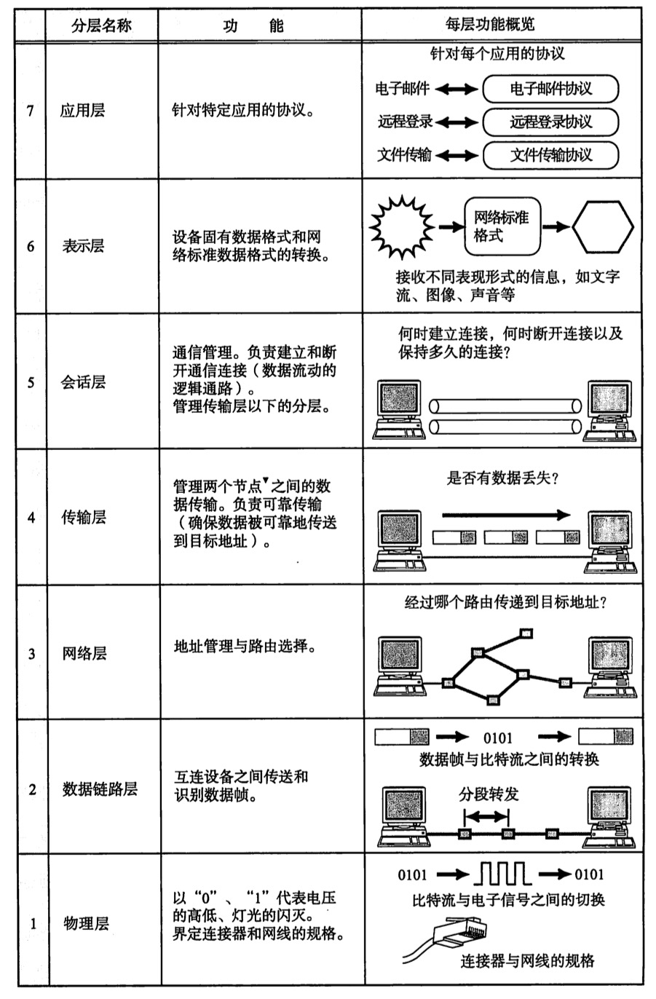
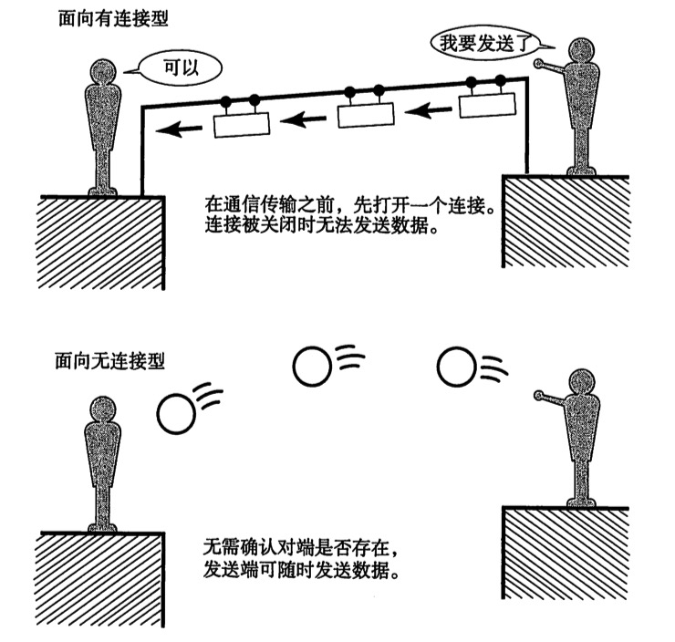
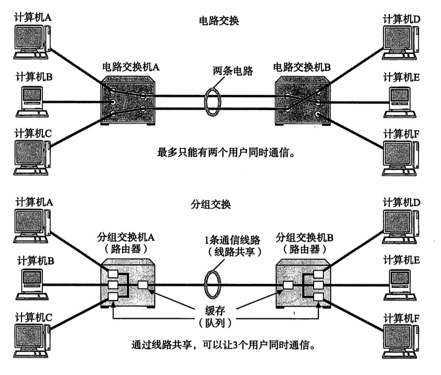
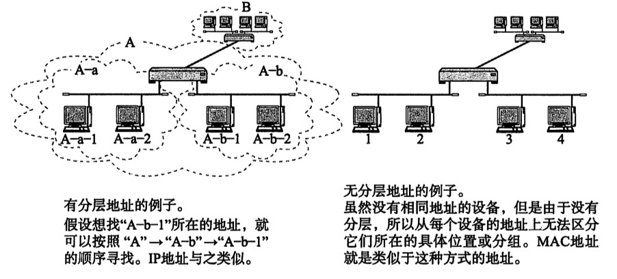
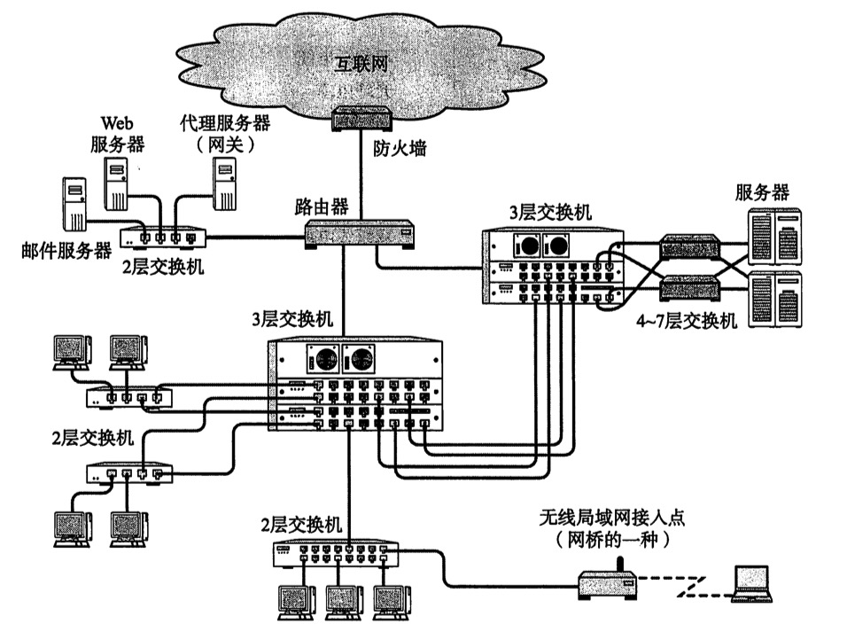

# TCP/IP协议

<!-- TOC -->

- [TCP/IP协议](#tcpip协议)
    - [一、网络基础知识](#一网络基础知识)
        - [1、背景](#1背景)
        - [2、7个阶段](#27个阶段)
        - [3、协议](#3协议)
        - [4、协议标准化](#4协议标准化)
        - [5、协议分层和OSI参考模型](#5协议分层和osi参考模型)
            - [1、协议分层](#1协议分层)
            - [2、OSI参考模型](#2osi参考模型)
        - [6、参考模型通信处理举例](#6参考模型通信处理举例)
        - [7、传输方式的分类](#7传输方式的分类)
        - [8、地址](#8地址)
        - [9、网络的构成要素](#9网络的构成要素)
    - [二、TCP/IP基础知识](#二tcpip基础知识)
    - [三、数据链路](#三数据链路)
    - [四、IP协议](#四ip协议)
    - [五、IP协议相关技术](#五ip协议相关技术)
    - [六、TCP与UDP](#六tcp与udp)
    - [七、路由协议](#七路由协议)
    - [八、应用协议](#八应用协议)
    - [九、网络安全](#九网络安全)
    - [十、参考资料](#十参考资料)

<!-- /TOC -->

## 一、网络基础知识

### 1、背景

独立模式->网络互连模式

计算机网络，根据规模分为广域网WAN（Wide Area Network）和局域网LAN（Local Area Network）

### 2、7个阶段

- 批处理系统 Batch Processing
  - 事先将用户程序和数据装入卡带或磁带，1950年
- 分时系统 Time Sharing System
  - 允许多个用户同时操作一台计算机，研究机关，1960年
- 计算机之间的通信
  - 计算机性能提升、体积小型化、价格下降，一般企业开始使用，1970年
- 计算机网络的产生
  - 窗口系统的诞生，个人，下载，邮件，1980年
- 互联网的普及
  - 一人一机，万维网WWW（World Wide Web），1990年
- 以互联网技术为中心的时代
  - IP（Internet Protocol）诞生，2000年
- TCP/IP
  - 互联网是由许多独立发展的网络通信技术融合而成，2010年

### 3、协议

大部分常见的协议都属于TCP/IP协议

简单说，协议就是计算机与计算机之间通过网络实现通信时事先达成的一种**约定**，相同的协议才能相互通信

分组交换协议是指将大数据分割为一个个包（Packet）的较小单位进行传输

### 4、协议标准化

国际标准化组织ISO（International Origanizion for Standards）
制定了
开放式通信系统互联参考模型OSI（Open Systems Interconnection）

### 5、协议分层和OSI参考模型

#### 1、协议分层

- 分层的优点：可扩展性和灵活性
- 分层的缺点：每个模块不得不实现相似的处理逻辑

#### 2、OSI参考模型

7个分层

7个分层对应的作用

### 6、参考模型通信处理举例

略

### 7、传输方式的分类

- 面向有连接型与面向无连接型

- 电路交换与分组交换

- 根据接收端数量分类

这里截图有误，右上应该是广播

### 8、地址

- 唯一性
- 层次性

### 9、网络的构成要素

- 通信媒介与数据链路
  - 计算机通过电缆相互连接
  - 媒介是电磁波
- 网卡
  - 网络接口器NIC（Network Information Center）
- 中继器Repeater
  - 属于OSI第一层--物理层
- 网桥/2层交换机
  - 属于OSI第二层--数据链路层
- 路由器/3层交换机
  - 属于OSI第三层--网络层
- 4~7层交换机
  - 负责处理传输层到应用层的数据，比如防火墙
- 网关
  - 负责传输层到应用层的数据进行转换和转发，比如代理服务器

## 二、TCP/IP基础知识

## 三、数据链路

## 四、IP协议

## 五、IP协议相关技术

## 六、TCP与UDP

## 七、路由协议

## 八、应用协议

## 九、网络安全

## 十、参考资料

[图解TCP/IP](https://book.douban.com/subject/24737674/)